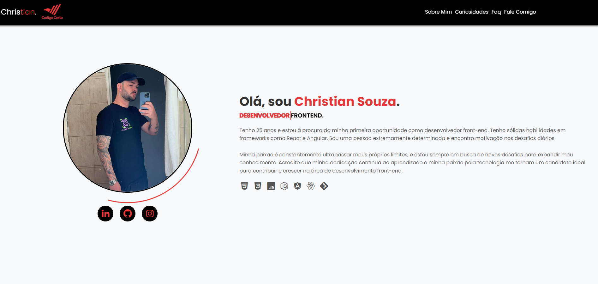
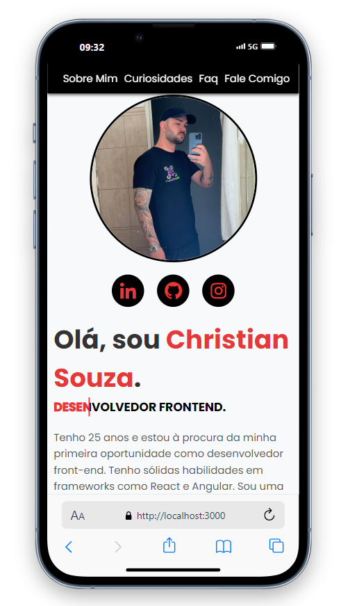
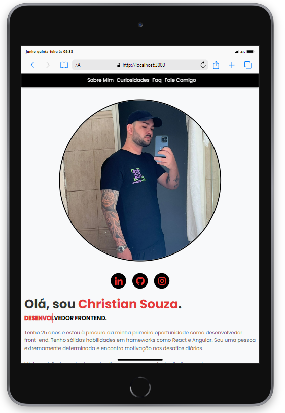

# Carta de apresentação Código Certo Coders!

<h2>Projeto realizado para a trilha de front end da Código Certo Coders.</h2>

Gostei muito de realizar esse projeto, no caminho tive algumas dificuldades, mas no final consegui concluir com êxito!

<b>Tecnologias utilizadas:</b>
 
-React
 
-Styled Components
 
-react-faq-components

A aplicação está totalmente responsiva, tanto para desktops quanto para smartphones.

### Interface Desktop

### Interface Mobile

### Inteface Tablet

  

## Conecte-se comigo no LinkedIn

  

